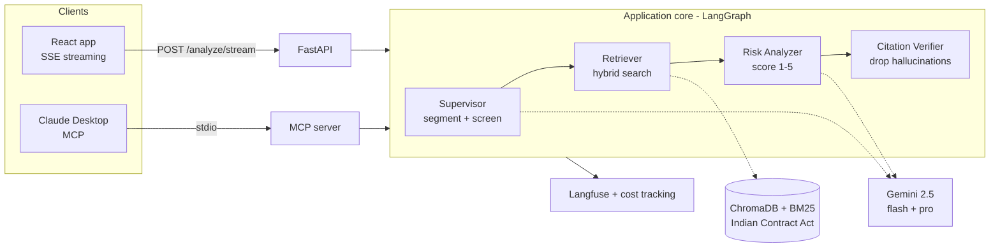

<div align="center">

# ClauseIQ

**A multi-agent AI system that reads an Indian contract, flags the clauses that are unfair to you with a severity score, and cites the exact section of Indian law behind each one.**

Runs as a streaming web app **and** as an MCP server inside Claude Desktop.

[Live app](https://clauseiq.vercel.app) · [Architecture](docs/ARCHITECTURE.md) · [Eval methodology](docs/EVAL_METHODOLOGY.md) · [Deploy](docs/DEPLOY.md) · [MCP install](docs/MCP_INSTALL.md)

</div>

---

## The problem

People in India sign rental, employment, and freelance contracts every day with
clauses that are quietly **unfair — or unenforceable** under Indian law, and have
no way to tell which. A 12-month lock-in that forfeits your *entire* deposit. A
two-year, all-India non-compete. "Raise any dispute within 7 days or lose it
forever." Lawyers are expensive; generic AI chatbots hallucinate sections of law
that don't exist.

ClauseIQ is the tool I wanted to exist: it reads the contract, flags the risky
clauses with a 1–5 severity score, explains *why* in plain language, and — the
part that matters — **backs every flag with a real, verified citation** to the
Indian Contract Act, 1872.

## Live demo

> Add a GIF/screenshots here: `docs/assets/demo.gif`, `docs/assets/analysis.png`.

- **Web app:** https://clauseiq.vercel.app — paste a contract or upload a PDF and watch the agents work live.
- **In Claude Desktop (MCP):** ask *"analyse this contract for unfair clauses"* — see [docs/MCP_INSTALL.md](docs/MCP_INSTALL.md).

## System architecture

One application core, exposed through two front doors (a REST/streaming API and an
MCP server). The analysis itself is a **LangGraph** state machine of four agents:



Hybrid retrieval fuses dense vectors (ChromaDB) and lexical BM25 via Reciprocal
Rank Fusion. The **Citation Verifier** is the anti-hallucination guarantee: any
cited section that isn't in the corpus is dropped before you ever see it. Full
detail in [docs/ARCHITECTURE.md](docs/ARCHITECTURE.md).

## Key design decisions

1. **One core, two front doors (dual-mode MCP).** The agents live in the
   application layer with zero knowledge of transport; FastAPI and the MCP server
   are thin adapters over the same `ContractAnalyzer`. *Tradeoff:* a strict
   hexagonal boundary is more upfront structure, but it's why the exact same
   analysis runs in a browser and inside Claude Desktop with no duplicated logic.
2. **Gemini via Vertex AI, with automatic fallback to AI Studio.** Orchestration on
   `gemini-2.5-flash`, analysis on `gemini-2.5-pro`. In production it runs on
   **Vertex AI** (billed to GCP credits, authenticated by the Cloud Run service
   account — no key on the server); if Vertex is unavailable or the credits run out,
   the client **automatically falls back to an AI Studio key**, so the app keeps
   working. *Tradeoff:* a single-vendor (Google) dependency, in exchange for ~zero
   cost, strong structured output, and resilience — and Claude is still free via the
   user's own Claude Desktop over MCP.
3. **A deterministic citation metric, not just LLM judges.** Citation accuracy is
   checked against the actual statute (existence + text overlap), so the
   anti-hallucination guarantee never depends on another model's opinion.
   *Tradeoff:* it only catches citation faults, so it's paired with LLM-judged
   faithfulness for the rest.
4. **Eval-gated CI.** A 20-case golden dataset runs in CI; the build fails if
   faithfulness or citation accuracy regress. *Tradeoff:* slower, token-spending
   CI, but prompt regressions can't silently ship.
5. **Result types + guardrails over exceptions for expected failures.** Expected
   failures (not-a-contract, prompt injection, missing law) are typed `Result`
   values and explicit guardrails, not stack traces. *Tradeoff:* more verbose call
   sites, far more predictable behaviour at the API/MCP boundary.

## Evaluation results

Measured by [DeepEval](docs/EVAL_METHODOLOGY.md) over the full 20-case golden
dataset (5 each: rental, employment, NDA, vendor). LLM-judged metrics use Gemini
as judge; **Citation Accuracy is deterministic** (checked against the statute).

| Metric | Score | Gate | Type |
|---|---|---|---|
| **Citation Accuracy** | **1.00** | ≥ 0.90 ✅ | deterministic |
| **Faithfulness** | **0.90** | ≥ 0.85 ✅ | LLM judge |
| Answer Relevancy | 0.90 | informational | LLM judge |
| Legal Soundness (G-Eval) | 0.82 | informational | LLM judge |
| Contextual Precision | 0.57 | informational | LLM judge |
| Contextual Recall | 0.26 | informational † | LLM judge |

CI gates on **Citation Accuracy + Faithfulness** — the deterministic
anti-hallucination guarantee plus grounding. The rest are reported for insight.

> † Contextual Recall compares the *gold summary* against the *raw statute snippets*
> cited, which structurally understates it (the summary states legal conclusions not
> verbatim in the statute) — it's not a retrieval failure, as the perfect Citation
> Accuracy and 0.90 Faithfulness show. See [docs/EVAL_METHODOLOGY.md](docs/EVAL_METHODOLOGY.md).
>
> Scores are produced by `tests/evaluation/` and gated in CI.

## Cost per query

Per analysis (segmentation on `gemini-2.5-flash` + per-clause analysis on
`gemini-2.5-pro`), tracked live via a per-model price table and surfaced in logs,
the SSE `done` event, and Langfuse.

Measured across the 20-case eval run (avg; range $0.0034–$0.0190 by contract size).

| Component | Model | ~Cost / contract |
|---|---|---|
| Segmentation / orchestration | gemini-2.5-flash | ~$0.0008 |
| Clause analysis | gemini-2.5-pro | ~$0.0063 |
| Retrieval + citation verify | local / deterministic | $0 |
| Embeddings | all-MiniLM-L6-v2 (local) | $0 |
| **Total per contract** | | **~$0.007** |

## What I'd do differently

- **Hosted vector DB + per-tenant isolation.** Embedded ChromaDB is perfect for a
  single-instance demo; a real product needs a managed store and isolation.
- **Expand the law corpus.** Today it's the Indian Contract Act, 1872; rent-control
  and labour statutes are stubbed. State-specific coverage is the obvious next step.
- **Severity-calibration metric.** The eval checks faithfulness and citations; I'd
  add a per-clause severity-MAE metric against expert labels.
- **Adversarial golden cases.** Add benign/near-miss contracts to measure the
  false-positive rate, not just recall on unfair clauses.

## Tech stack

| Backend | Frontend |
|---|---|
| Python 3.11, FastAPI | React 18, Vite, TypeScript (strict) |
| LangGraph (multi-agent) | Tailwind v4, shadcn/ui |
| ChromaDB + rank-bm25 (RRF) | TanStack Query, Zustand |
| sentence-transformers (MiniLM) | Zod (runtime validation) |
| Google Gemini 2.5 (flash + pro) | Framer Motion (streaming UI) |
| MCP (FastMCP, stdio) | Biome, Vitest |
| DeepEval, Langfuse, structlog | pnpm |
| uv, ruff, mypy --strict, pytest | Lighthouse 100/98/100/91 |

## Quickstart

```bash
# Backend (terminal 1)
uv sync
echo "CLAUSEIQ_GEMINI_API_KEY=your_key" > .env
uv run python scripts/ingest_laws.py          # build the vector index (once)
uv run uvicorn clauseiq.interfaces.api.main:app --app-dir src --reload --port 8000

# Frontend (terminal 2)
cd frontend && pnpm install && pnpm dev        # http://localhost:5173
```

API docs at http://localhost:8000/docs. Run the test suite with `uv run pytest`.

**Deploy:** backend on Cloud Run, frontend on Vercel, Gemini on Vertex AI with
AI-Studio fallback — see **[docs/DEPLOY.md](docs/DEPLOY.md)**.

## Install into Claude Desktop (MCP)

ClauseIQ runs as an MCP server, so you can analyse contracts and look up Indian
law directly inside Claude Desktop. Setup takes under a minute —
see **[docs/MCP_INSTALL.md](docs/MCP_INSTALL.md)**.

---

> **Disclaimer:** ClauseIQ is automated decision-support, **not legal advice**.
> Amendment history is not tracked; verify current law for time-sensitive matters.
